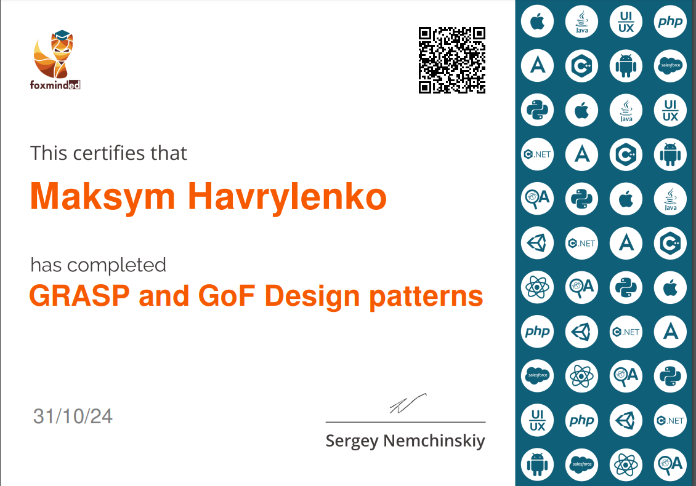

# Famous design patterns on PHP 
## (GRASP Patterns & GoF Patterns)


### GRASP Patterns:
- **Information Expert** [_code_](src/grasp/information-expert.php) https://habr.com/ru/companies/otus/articles/491636/
  _Информацию обрабатываем там, где она содержится._

- **Creator** [_code_](src/grasp/creator.php) https://habr.com/ru/companies/otus/articles/505618/ - _Cоздаем объекты там, где они нужны._

- **Controller** - _Выносим логику многопоточности в отдельный класс или компонент._

- **Low Coupling + High Cohesion** [code](src/grasp/low-coupling-high-cohesion.php) https://habr.com/ru/companies/otus/articles/505852/ 
   - _Проектируем классы с однородной бизнес-логикой и минимальным количеством связей между собой._

- **Polymorphism** https://habr.com/ru/companies/otus/articles/507600/ - _Различные варианты поведения системы при необходимости оформляем в виде полиморфных вызовов._

- **Pure Fabrication** — _не стесняемся создавать классы, не имеющие аналог в предметной области, если это необходимо для соблюдения Low Coupling и High Cohesion._

- **Indirection** https://habr.com/ru/companies/otus/articles/521476/ — _Любой класс вызываем через его интерфейс._

- **Protected Variations** https://habr.com/ru/companies/otus/articles/521476/ — применяя все вышесказанное, получаем устойчивый к изменениям код.
   - Необходимо спроектировать систему так, чтобы изменение одних ее элементов не влияло на другие. В качестве решения предлагается идентифицировать точки возмоджных изменений или неустойчивости и распределить обязанности таким образом, чтобы обеспечить устойчивую работу системы.

### GoF Patterns
**Creational (Порождающие):**
- **Fabric Method** [_code_](src/gof/factory-method.php) (Фабричный метод):
    https://refactoring.guru/ru/design-patterns/factory-method

- **Abstract Factory** [_code_](src/gof/abstract-factory.php) (Абстрактная фабрика):
    https://refactoring.guru/ru/design-patterns/abstract-factory

- **Prototype** [_code_](src/gof/prototype.php) (Прототип) : 
   https://refactoring.guru/ru/design-patterns/prototype

- **Builder** [_code_](src/gof/builder.php) (Строитель, [Строитель с директором]((src/gof/builder-with-director.php))) : 
   https://refactoring.guru/ru/design-patterns/builder

- **Singleton** [_code_](src/gof/singleton.php) (Одиночка) : 
   https://refactoring.guru/ru/design-patterns/singleton

**Structural (Структурные):**
- **Adapter** [_code_](src/gof/adapter.php) (Адаптер):
  https://refactoring.guru/ru/design-patterns/adapter

- **Bridge** [_code_](src/gof/bridge.php) (Мост):
  https://refactoring.guru/ru/design-patterns/bridge

- **Composite** [_code_](src/gof/composite.php) (Компоновщик):
  https://refactoring.guru/ru/design-patterns/composite

- **Decorator** [_code_](src/gof/decorator.php) (Декоратор):
  https://refactoring.guru/ru/design-patterns/decorator

- **Facade** [_code_](src/gof/facade.php) (Фасад):
  https://refactoring.guru/ru/design-patterns/facade

- **Flyweight** [_code_](src/gof/flyweight.php) (Легковес):
  https://refactoring.guru/ru/design-patterns/flyweight

- **Proxy** [_code_](src/gof/proxy.php) (Заместитель):
    https://refactoring.guru/ru/design-patterns/proxy

  
**Behavioral (Поведенческие):**
- **Chain of Responsibility** [_code_](src/gof/chain-of-responsibility.php) (Цепочка обязанностей):
  https://refactoring.guru/ru/design-patterns/chain-of-responsibility 
- **Command** [_code_](src/gof/command.php) (Команда):
    https://refactoring.guru/ru/design-patterns/command
- **Interpreter** [_code_](src/gof/interpreter.php) (Интерпретатор):
  - https://bool.dev/blog/detail/povedencheskie-patterny-interpretator-csharp
  - https://github.com/RefactoringGuru/design-patterns-php/blob/main/src/RefactoringGuru/Interpreter/RealWorld/index.php
- **Iterator** [_code_](src/gof/iterator.php) (Итератор):
  https://refactoring.guru/ru/design-patterns/iterator
- **Mediator** [_code_](src/gof/mediator.php) (Посредник):
  https://refactoring.guru/ru/design-patterns/mediator
- **Memento** [_code_](src/gof/memento.php) (Снимок):
  https://refactoring.guru/ru/design-patterns/memento
- **Observer** [_code_](src/gof/observer.php) (Наблюдатель):
  https://refactoring.guru/ru/design-patterns/observer
- **State** [_code_](src/gof/state.php) (Состояние):
  https://refactoring.guru/ru/design-patterns/state
- **Strategy** [_code_](src/gof/strategy.php) (Стратегия):
  https://refactoring.guru/ru/design-patterns/strategy
- **Template Method** [_code_](src/gof/template-method.php) (Шаблонный метод):
  https://refactoring.guru/ru/design-patterns/template-method
- **Visitor** [_code_](src/gof/visitor.php) (Посетитель):
  https://refactoring.guru/ru/design-patterns/visitor

## Getting started

```
git clone git@github.com:maxlen/design-patterns.git
```

## Run project

```
# Go to project directory
cd design-patterns

# run particular pattern (example)
php src/gof/abstract-factory.php

```
## Certificate


### whoami
That git-repository created by Maxim Gavrilenko https://www.linkedin.com/in/maxim-gavrilenko
